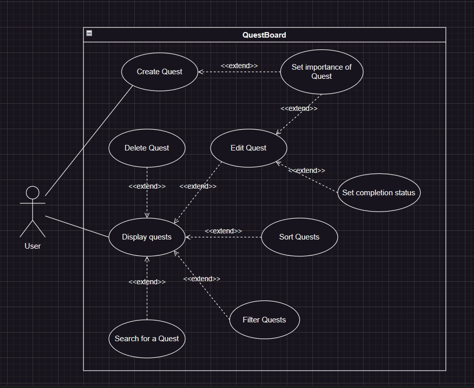

# QuestBoard

**QuestBoard** is a simple, user-friendly To-Do application that allows users to manage their tasks (referred to as "quests") through basic CRUD operations: creating, retrieving, updating, and deleting tasks. The app also includes functionality to sort tasks based on their ID.

## Table of Contents
- [Vision of the project](#vision-of-the-project)
- [Tech Stack](#tech-stack)
- [Installation](#installation)
  - [Backend Setup](#backend-setup)
  - [Frontend Setup](#frontend-setup)
  - [Connecting Frontend and Backend](#connecting-frontend-and-backend)
- [Usage](#usage)
  - [Use Case Diagram](#use-case-diagram)
- [API Endpoints](#api-endpoints)
- [Glossary of the ky terms for QuestBoard](#glossary-of-the-key-terms-for-questboard)

---

## Vision of the project
**QuestBoard** is a streamlined task management app designed to help individuals and teams organize their daily tasks with ease. Each task, or "quest," is displayed clearly with options to edit, delete, and sort, allowing users to stay on top of their priorities. With its simple interface and dynamic display, QuestBoard makes task management efficient and stress-free.

**Purpose:** QuestBoard solves the problem of task overload by allowing users to create, track, and update tasks in real time. The app helps users stay organized, focused, and productive, whether they’re managing personal tasks or team projects.

**Ideal Users:** Busy professionals, students, and anyone looking for a practical solution to manage their to-do list effectively.

## Tech Stack
- **Frontend**: HTML, CSS, Vanilla JavaScript
- **Backend**: Java, Spring Boot

## Installation

### Prerequisites
- **Java** (v11 or later)
- **Maven** (v3.9.9)
- **Node.js** (v20.12.2)

### Backend Setup
1. Clone the repository:
   ```cmd
   git clone https://github.com/your-username/To_Do_App.git
   cd To_Do_App/backend
   ```
2. Install dependencies and build the project:
   ```cmd
   mvn clean install
   ```
3. Start the Spring Boot application:
    ```cmd
    mvn spring-boot:run
    ```

### Frontend Setup
1. Go to the frontend directory:4
    ```cmd
    cd ../frontend
    ```
2. Install the dependencies if any, and run the frontend server with Node.js:
    ```cmd
    npm install express
    node app.js
    ```
By default, this will run the frontend on http://localhost:3000.

### Connecting Frontend and Backend
- The frontend will make HTTP requests to the backend API running on http://localhost:8080 to perform CRUD operations. Ensure CORS is configured on the backend to allow requests from http://localhost:3000.

## Usage
1. **Creating a Quest:** Use the form on the frontend to add a new quest.
2. **Updating a Quest:** Click on the edit button near a quest to edit its description.
3. **Deleting a Quest by ID:** Click the delete button next to a quest to remove it based on it's ID.
4. **Sorting by ID** Use the sort button to reorder quests based on their ID.

### Use Case Diagram



## API Endpoints
- **GET /api/index:** Retrieve all quests
- **POST /api/index:** Add a new quest.
- **PUT /api/index/{id}:** Update an existing quest.
- **DELETE /api/index/{id}:** Delete a quest by ID.

## Glossary of the key terms for QuestBoard
**CRUD:** Stands for Create, Read, Update, and Delete. These are the four basic functions for interacting with database records, enabling users to add, view, modify, and remove tasks (quests) in QuestBoard.

**Quest:** A task or action item entered by the user, consisting of a description and a unique ID. Each quest represents a goal or task the user wants to manage within the app.

**ID:** A unique identifier assigned to each quest upon creation. IDs allow the app to manage, retrieve, update, and delete specific quests, ensuring no two quests are confused.

**Database:** A structured data storage system used by QuestBoard to securely store and retrieve quests. Each quest, including its ID and description, is saved to the database, making it accessible even when the user refreshes the page.

**Dynamic Display:** A feature allowing quests to be immediately shown or updated on the browser without needing a page reload. This real-time updating enhances user interaction by reflecting changes instantly.

**Sort Functionality:** An option that allows users to organize quests based on their ID in either ascending or descending order. This feature helps users prioritize tasks or locate specific quests more easily.

**Backend:** The part of QuestBoard’s software that operates on the server side, built with Spring Boot. It manages the app’s core logic, database interactions, and provides data to the frontend.

**Frontend:** The part of the application visible to the user, built with HTML, CSS, and JavaScript. It includes the input field, buttons, and quest display area, creating the interface through which users interact with their quests.

**Spring Boot:** A framework used for building the backend of QuestBoard. It provides a streamlined way to develop a robust and scalable backend for managing quests.

**Bootstrap:** A front-end toolkit used to style and layout QuestBoard’s interface. Bootstrap provides pre-built components and styles that help make the app responsive and visually appealing.

**Button:** An interactive element in QuestBoard that allows users to create, update, or delete a quest. Buttons also enable sorting quests by ID, providing essential controls for managing tasks.


# Task Management System - New Functionality

## Overview
In this version of the Task Management System, new functionalities have been implemented to allow users to:
- Mark tasks as **Important**.
- **Filter** tasks by importance.
- **Sort** tasks by their ID in ascending or descending order.

These new features enhance task management by allowing users to prioritize important tasks and view tasks in a flexible order.

## New Functionalities Implemented

### 1. Marking Tasks as Important
- **Functionality**: Users can now mark tasks as "Important" when they create them.
- **How It Works**:
  - When creating a new task, the user can check a "Mark as Important" checkbox to designate the task as important.
  - Once marked as important, the task will be displayed with an "Important" label in the UI to differentiate it from other tasks.
  - This functionality is useful for prioritizing tasks that require immediate attention.
  
### 2. Filtering Tasks by Importance
- **Functionality**: Users can now filter tasks to view only those marked as important.
- **How It Works**:
  - The user can click a "Filter Important Tasks" button to view only tasks that have been marked as important.
  - The user can also click the "Show All Tasks" button to reset the filter and display all tasks, including both important and non-important ones.
 
### 3. Editing Tasks revamped
- **Functionality**: Users now have more options when editing a certain task.
- **How it works**:
  - When the user has already created a task, they can click on the edit button and be greeted with a separate dialog window where they can change the description     of the task, change the importance or the completion status.
  
## How the New Functionalities Work

### Task Creation and Importance
- When creating a task, the user will be prompted to enter a description.
- The user can also check a checkbox labeled "Mark as Important" to designate the task as important.
- Once the task is created, if marked as important, it will be displayed with an "Important" label on the task card.

### Filtering Tasks
- The user can filter tasks by importance using a dropdown button labeled "Filter Tasks".
  - **Show All Tasks**: Displays all tasks in the current sort order.
  - **Important Tasks**: Filters the tasks to display only those marked as important.

### Editing Tasks
- Users can edit tasks by clicking the "Edit" button on a task.
- A dialog window opens, allowing users to:
  - Modify the description in an input field.
  - Toggle the "Mark as Important" checkbox to change the task's importance.
  - Adjust the completion status using a checkbox.
- Clicking "Apply" updates the task, which will reflect the new details in the task list.

## How the User Can Test the New Functionality

### Task Creation and Importance
1. **Create a New Task**:
   - In the "New Task" input field, type a description for the task.
   - Check the "Mark as Important" checkbox if you want to mark this task as important.
   - Click the "New Task" button to create the task.
   
2. **Check the Task List**:
   - After creating the task, it should appear in the list of tasks.
   - If marked as important, the task will be displayed with the "Important" label.

### Filtering Tasks by Importance
1. **Filter Tasks**:
   - Click on the "Filter Tasks" dropdown in the UI.
   - Select **"Important Tasks"** to only view tasks that are marked as important.
   - Click **"Show All Tasks"** to reset the filter and view all tasks.
   
2. **Verify the Filtering**:
   - When filtering for important tasks, only tasks marked as important should appear. When showing all tasks, all tasks should be displayed, including both important and non-important ones.

### Editing Tasks
1. **Edit a Task**:
  - Click the "Edit" button on a task in the list.
  - Change the description, importance, or completion status in the dialog window.
  - Click "Save Changes" to update the task.
    
2. **Verify Updates**:
  - Ensure the task reflects the new description in the list.
  - Check that the "Important" label is added or removed as appropriate.
  - Confirm that the completion status indicator updates correctly.

---
.
